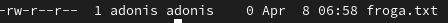
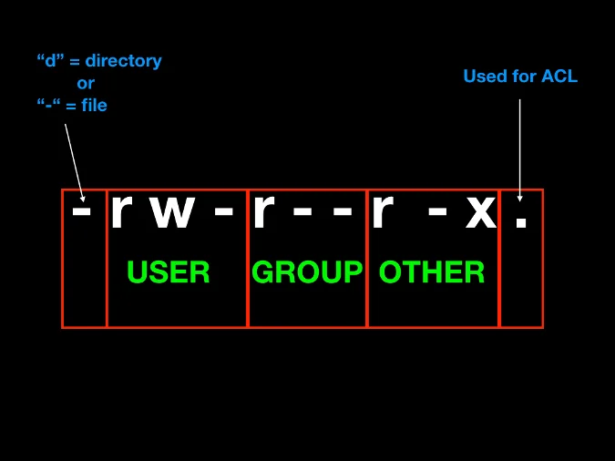
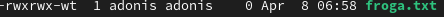

# Baimenak Linux
- [Baimenak Linux](#baimenak-linux)
  - [Fitxategi eta direktorioen baimenak](#fitxategi-eta-direktorioen-baimenak)
    - [Baimen taldeak](#baimen-taldeak)
    - [Baimenak esleitzen modu sinbolikoan](#baimenak-esleitzen-modu-sinbolikoan)
    - [Baimenak modu oktalea](#baimenak-modu-oktalea)
  - [Sticky bit baimena](#sticky-bit-baimena)

## Fitxategi eta direktorioen baimenak

Fitxategi eta direktorioen baimenak hurrengo aginduekin ikusi ditzakegu.

```bash
ls -al
```



### Baimen taldeak

**- jabea (user) :** Fitxategi bat sortzen dugunean, sortzailea jabea izango da defektuz.
**- Talde (group) :** Fitxategi  batean jabetzea talde bati ere bai dagokio.
**- Besteak (other) :** Jabeak edo taldekideak ez direnak.



### Baimenak esleitzen modu sinbolikoan

Linuxen baimen motak eta `chmod` aginduaren erabilera eremu batzuk direnak azaltzeko, hemen dituzue:

1. **Baimen Motak:**
   - **R (Read)**: Irakurketa baimena, fitxategia irakurri ahal izateko.
   - **W (Write)**: Idazketa baimena, fitxategian edo direktorioan edukia aldatzeko eta gorde ahal izateko.
   - **X (Execute)**: Exekuzio baimena, fitxategia exekutatzeko ahalmena.

2. **chmod Agindua:**
   - `chmod` aginduak baimenak aldatzeko erabiltzen da. Lehenengo, erabiltzaile, taldea edo beste inor erabiltzaile edo taldea aukeratzen da.
   - Gero, baimen mota zehatzak zehaztu behar dira (`u` erabiltzailearentzat, `g` taldearentzat eta `o` beste guztientzat).
   - Azkenik, baimenak zehaztu behar dira (`+` baimen bat gehitzeko, `-` baimen bat kendu eta `=` baimenak lehendik zehaztuta daudenak aldatzeko).

Adibideak:

- `chmod u+x file.txt`: Erabiltzaileari exekuzio baimena ematen dio `file.txt` fitxategiari.
- `chmod go-r file.txt`: Taldea eta beste erabiltzaile guztiek irakurketa baimena kendu `file.txt` fitxategitik.
- `chmod u=rw,go=r file.txt`: Erabiltzaileak irakurketa eta idazketa baimenak ditu, eta taldea eta beste erabiltzaile guztiek irakurketa baimena dute `file.txt` fitxategian.

Eremu batzuk azaltzeko gai izan beharko litzateke:

- **Sistema fitxategiak eta direktorioak**: Baimenak ondo kudeatu behar dira sistema fitxategi eta direktorioetan, sistema-konfigurazio fitxategiak eta ingurune-sistemaren konfigurazio fitxategiak barne. Ez dute exekutatze baimenik izan behar, salbu exe-ekutarako fitxategiak.
  
- **Programen exekuzioa**: Programak exekutatzen direnean, sistema horiek irakurtzen ditu eta exekutatzen duzun fitxategiaren baimenak begiratzen ditu, beraz, exekuzio baimena behar du.

- **Erabiltzaile-baimenak**: Erabiltzaileak soilik nahi dituen fitxategiak aldatu, ez beste erabiltzaileak edo taldeak. Horretarako, `chmod` erabiltzen duen erabiltzaileak fitxategiaren jabea izan behar du edo administratzaile-kontu baimenak behar ditu.

Baimenak kudeatzeko, Linuxen fitxategi- eta direktorio-possesioaren inguruko ezagutza osoa beharrezkoa da. Aukeratu beharreko baimen mota eta chmod aginduak kalkulatu behar dira erabiltzaileak eta sistemaren beharrak kontuan hartuz.
Adibidez,jabeari (user) exekuzio baimena horrela eman ahal diogu.
```bash
chmod u+x froga.txt
```
Horrela,taldeari eta besteei exekuzio eta idazteko baimenak emango dizkiegu.
```bash
chmod go+wx froga.txt
```
besteei,irakurtzeko baimena horrela kendu diezaiokegu.
```bash
chmod o-r froga.txt
```

### Baimenak modu oktalea

- 0 = 000 = --- = baimenarik gabe
- 1 = 001 = --x = exekuzio baimena
- 2 = 010 = -w- = idazteko baimena
- 3 = 011 = -wx = idazteko eta exekutatzeko baimena
- 4 = 100 = r- = irakurtzeko baimena
- 5 = 101 = r-w = irakurtzeko eta exekutatzeko baimena
- 6 = 110 = rx- = irakurtzeko eta idazteko baimena
- 7 = 111 = rwx = baimena guztiak

adibidez,baimen guztiak kentzeko
```bash
chmod 000 froga.txt
```

baimen guztiak gehitzeko
```bash
chmod 777 froga.txt
```

Erabiltzaileari baimen guztiak emateko eta besteei edo taldekideei irakurtzeko eta exekuzio baimena emateko
```bash
chmod 755 froga.txt
```

## Sticky bit baimena

sticky bita daukan fitxategia edo direktorio bat bakarrik jabea edo rootek aldatu ahal dio izena edo ezabatu ahal du.

sticky bita gehitzeko
```bash
chmod +t froga.txt
```


